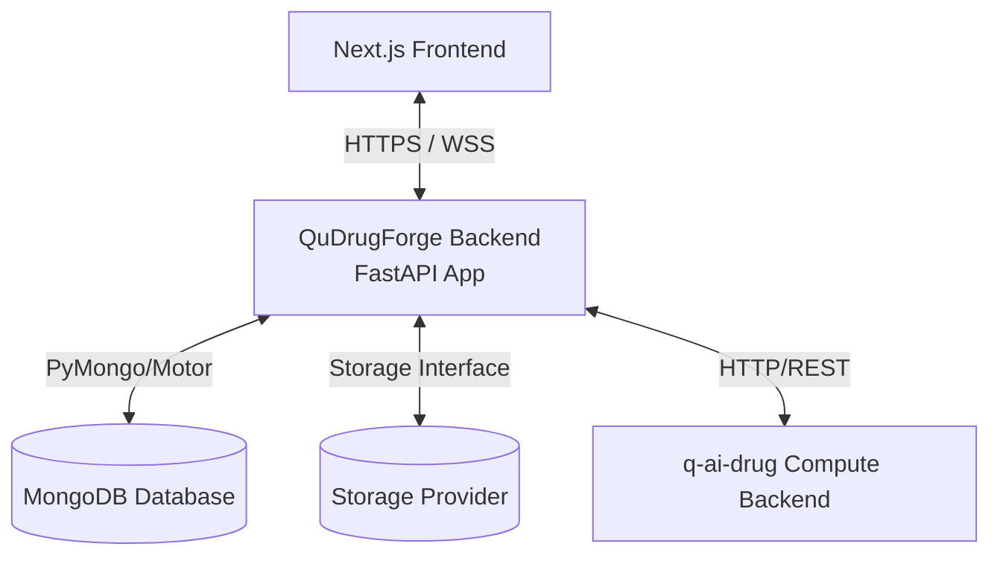

# QuDrugForge™ Backend
> **Quantum AI Drug Discovery Platform - Core Application Server**

QuDrugForge™ is a state-of-the-art Quantum AI Drug Discovery Platform. This repository contains the application backend built with **Python** and **FastAPI**, designed to coordinate research workspaces, manage chemical datasets, interface with advanced quantum compute engines, and serve high-fidelity scientific data visualization clients.

---

## 1. Core Purpose & Capabilities

The QuDrugForge™ application backend bridges the Next.js frontend prototype to physical databases, secure binary file stores, and external high-performance GPU simulation clusters. It acts as the central coordinator for:
* **Governance**: Secure workspace collaboration, compliance logs, and credential routing.
* **Chemical Data Ingestion**: Storage registry tracking physical proteins (PDB) and candidate molecular ligands (SDF/CSV).
* **Research Workspace Orchestration**: Launching AutoDock Vina, deep learning (GNINA) CNN poses, density functional theory (DFT) descriptor predictions, and ADMET toxicity profiling.
* **Science Translators**: Standardizing massive scientific outputs into rich, interactive visualization payloads (used in 3D chemical workspaces and dimensional chemical spaces).

---

## 2. Architectural Summary

QuDrugForge relies on a strictly structured decoupled architecture:



* **Application Backend** (This Repository): Houses user states, workspace parameters, metrics histories, file metadata catalogs, and acts as the gatekeeper.
* **Compute Engine** (`q-ai-drug` - External): An autonomous scientific compute cluster running intensive simulation tasks. **The frontend never communicates directly with the compute engine.**
* **Structured Data** (MongoDB): Holds JSON-native schemas representing molecular properties, workspace metrics, and configuration profiles. **MongoDB is never loaded with large raw files.**
* **Abstracted File Store**: Multi-cloud driver abstraction managing file binaries (`uploads`, `artifacts`, `reports`, `temp`) across local directories or enterprise cloud buckets (S3, Cloudflare R2, MinIO, Azure Blob).

---

## 3. Directory Layout

The codebase implements a clean, modular DDD (Domain-Driven Design) and Repository-Service pattern hierarchy:

```text
qudrugforge-backend/
├── app/
│   ├── main.py                     # Main application entrypoint & routing setup
│   ├── core/                       # App lifecycle settings, databases, and logs
│   │   ├── config.py               # Pydantic environment configurations
│   │   ├── database.py             # MongoDB Motor clients hooks
│   │   ├── security.py             # Password hashing and JWT generation
│   │   ├── logging.py              # Centralized logging formatters
│   │   └── exceptions.py           # Structured error handling handlers
│   ├── api/                        # HTTP Endpoint controllers
│   │   └── v1/
│   │       └── router.py           # Master V1 API Router
│   ├── schemas/                    # Pydantic v2 Request/Response models
│   ├── models/                     # MongoDB document models
│   ├── repositories/               # Raw Database CRUD operation abstraction
│   ├── services/                   # Business rules logic orchestrations
│   ├── storage/                    # Binary storage adapters (local, S3, etc.)
│   │   ├── base.py                 # Abstract storage driver contract
│   │   ├── local.py                # Secure local filesystem provider
│   │   └── service.py              # Central storage resolver
│   ├── integrations/               # Communication wrappers for external services
│   │   └── q_ai_drug_client.py     # q-ai-drug compute client adapter
│   └── utils/                      # Ephemeral structural helpers
├── storage/                        # Physical developer storage root
│   ├── uploads/                    # Original user uploads (proteins, libraries)
│   ├── artifacts/                  # Docking poses, QML scores
│   ├── reports/                    # Compiled analytical PDF/HTML studies
│   └── temp/                       # Temporary task packages
├── tests/                          # PyTest automated validation scripts
├── scripts/                        # Dev orchestration utility tools
├── docs/                           # Strategic architecture and mappings papers
├── .env.example                    # Environment variable configurations
├── .gitignore                      # Python and scientific paths filters
├── requirements.txt                # System packages registry
└── README.md                       # Repository guide
```

---

## 4. Development Setup

> [!NOTE]
> **This is a Phase 0 Foundation release.**
> The database and compute clients are pre-configured placeholders. You can run the application immediately locally without having active MongoDB or `q-ai-drug` clusters running online.

### Step 1: Environment Configuration
Copy the template variables file into a running `.env` file:
```bash
cp .env.example .env
```

### Step 2: Establish Virtual Environment & Install Packages
```bash
# Create environment
python -m venv .venv

# Activate on Windows
.venv\Scripts\activate

# Install dependencies
pip install -r requirements.txt
```

### Step 3: Launch Local Web Server
Start the local FastAPI development server:
```bash
uvicorn app.main:app --reload --port 8000
```

* **Interactive API Schema**: Open [http://127.0.0.1:8000/docs](http://127.0.0.1:8000/docs) in your browser to browse, test, and run available endpoints.
* **System Status Health Check**: Pinging [http://127.0.0.1:8000/health](http://127.0.0.1:8000/health) will confirm storage statuses.

---

## 5. Development Roadmap Summary

* [x] **Phase 0: Foundation Setup**: Provision clean repository frameworks, configuration schemas, storage models, and mapping specifications.
* [ ] **Phase 1: Identity, Workspaces & Files**: Implement MongoDB Motor integrations, local file storage uploading services, and complete user login/registration and workspace systems.
* [ ] **Phase 2: Project Workspace & Inputs**: Develop targets profiles management APIs, 3D coordinate boxes configurations, and chemical catalog engines.
* [ ] **Phase 3: Compute Orchestration**: Connect `q-ai-drug` client endpoints, implement callback pipelines, and ingest results (docking energies, CNN poses).
* [ ] **Phase 4: Advanced Descriptors & QML**: Integrate quantum density structures parsing and classical-quantum prioritization scores.
* [ ] **Phase 5: Cloud Storage & Verification**: Hook AWS S3/Cloudflare R2 providers, scale unit and system automated tests suites, and launch production containers.
