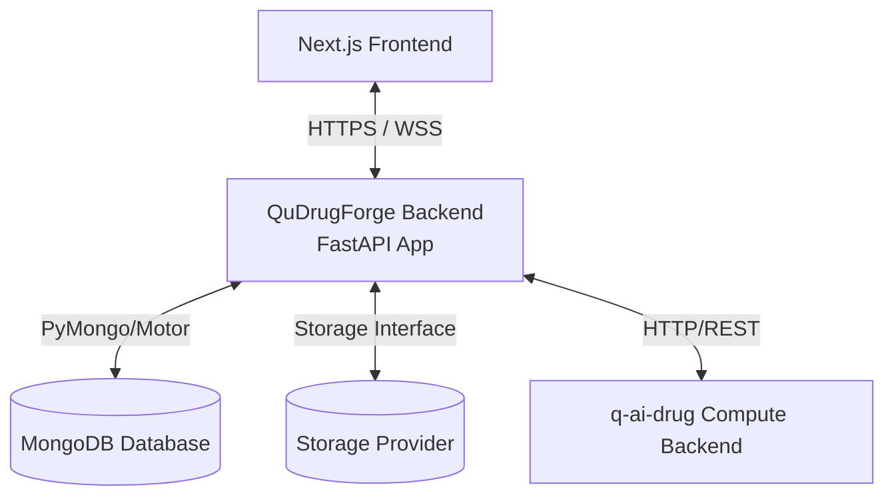

# QuDrugForge™ Backend
> **Quantum AI Drug Discovery Platform - Core Application Server**

QuDrugForge™ is a state-of-the-art Quantum AI Drug Discovery Platform. This repository contains the application backend built with **Python** and **FastAPI**, designed to coordinate research workspaces, manage chemical datasets, interface with advanced quantum compute engines, and serve high-fidelity scientific data visualization clients.

---

## 1. Core Purpose & Capabilities

The QuDrugForge™ application backend bridges the Next.js frontend prototype to physical databases, secure binary file stores, and external high-performance GPU simulation clusters. It acts as the central coordinator for:
* **Governance**: Secure workspace collaboration, compliance logs, and credential routing.
* **Chemical Data Ingestion**: Storage registry tracking physical proteins (PDB) and candidate molecular ligands (SDF/CSV).
* **Research Workspace Orchestration**: Launching AutoDock Vina, deep learning (GNINA) CNN poses, density functional theory (DFT) descriptor predictions, and ADMET toxicity profiling.
* **Science Translators**: Standardizing massive scientific outputs into rich, interactive visualization payloads (used in 3D chemical workspaces and dimensional chemical spaces).

---

## 2. Architectural Summary

QuDrugForge relies on a strictly structured decoupled architecture:



* **Application Backend** (This Repository): Houses user states, workspace parameters, metrics histories, file metadata catalogs, and acts as the gatekeeper.
* **Compute Engine** (`q-ai-drug` - External): An autonomous scientific compute cluster running intensive simulation tasks. **The frontend never communicates directly with the compute engine.**
* **Structured Data** (MongoDB): Holds JSON-native schemas representing molecular properties, workspace metrics, and configuration profiles. **MongoDB is never loaded with large raw files.**
* **Abstracted File Store**: Multi-cloud driver abstraction managing file binaries (`uploads`, `artifacts`, `reports`, `temp`) across local directories or enterprise cloud buckets (S3, Cloudflare R2, MinIO, Azure Blob).

---

## 3. Directory Layout

The codebase implements a clean, modular DDD (Domain-Driven Design) and Repository-Service pattern hierarchy:

```text
qudrugforge-backend/
├── app/
│   ├── main.py                     # Main application entrypoint & routing setup
│   ├── core/                       # App lifecycle settings, databases, and logs
│   │   ├── config.py               # Pydantic environment configurations
│   │   ├── database.py             # MongoDB Motor clients hooks
│   │   ├── security.py             # Password hashing and JWT generation
│   │   ├── logging.py              # Centralized logging formatters
│   │   └── exceptions.py           # Structured error handling handlers
│   ├── api/                        # HTTP Endpoint controllers
│   │   └── v1/
│   │       └── router.py           # Master V1 API Router
│   ├── schemas/                    # Pydantic v2 Request/Response models
│   ├── models/                     # MongoDB document models
│   ├── repositories/               # Raw Database CRUD operation abstraction
│   ├── services/                   # Business rules logic orchestrations
│   ├── storage/                    # Binary storage adapters (local, S3, etc.)
│   │   ├── base.py                 # Abstract storage driver contract
│   │   ├── local.py                # Secure local filesystem provider
│   │   └── service.py              # Central storage resolver
│   ├── integrations/               # Communication wrappers for external services
│   │   └── q_ai_drug_client.py     # q-ai-drug compute client adapter
│   └── utils/                      # Ephemeral structural helpers
├── storage/                        # Physical developer storage root
│   ├── uploads/                    # Original user uploads (proteins, libraries)
│   ├── artifacts/                  # Docking poses, QML scores
│   ├── reports/                    # Compiled analytical PDF/HTML studies
│   └── temp/                       # Temporary task packages
├── tests/                          # PyTest automated validation scripts
├── scripts/                        # Dev orchestration utility tools
├── docs/                           # Strategic architecture and mappings papers
├── .env.example                    # Environment variable configurations
├── .gitignore                      # Python and scientific paths filters
├── requirements.txt                # System packages registry
└── README.md                       # Repository guide
```

---

## 4. Development Setup

> [!NOTE]
> **This is a Phase 0 Foundation release.**
> The database and compute clients are pre-configured placeholders. You can run the application immediately locally without having active MongoDB or `q-ai-drug` clusters running online.

### Step 1: Environment Configuration
Copy the template variables file into a running `.env` file:
```bash
cp .env.example .env
```

### Step 2: Establish Virtual Environment & Install Packages
```bash
# Create environment
python -m venv .venv

# Activate on Windows
.venv\Scripts\activate

# Install dependencies
pip install -r requirements.txt
```

### Step 3: Launch Local Web Server
Start the local FastAPI development server:
```bash
uvicorn app.main:app --reload --port 8000
```

* **Interactive API Schema**: Open [http://127.0.0.1:8000/docs](http://127.0.0.1:8000/docs) in your browser to browse, test, and run available endpoints.
* **System Status Health Check**: Pinging [http://127.0.0.1:8000/health](http://127.0.0.1:8000/health) will confirm storage statuses.

---

## 5. Development Roadmap Summary

* [x] **Phase 0: Foundation Setup**: Provision clean repository frameworks, configuration schemas, storage models, and mapping specifications.
* [x] **Phase 1–9.5**: Auth, workspaces, projects, files, targets, molecules, q-ai-drug read-only, artifact importer, experiments/job tracking.
* [x] **Phase 10: Docking Backend APIs**: Docking run orchestration, MongoDB result APIs, imported q-ai-drug docking support.
* [x] **Phase 11: GNINA Backend APIs**: GNINA run scaffolding, status/log/result routes, pose metadata resolution, imported q-ai-drug GNINA support.
* [x] **Phase 12: Quantum/QML Backend APIs** _(current)_: Quantum run scaffolding, descriptor/QML/prefilter/reranking result routes, imported q-ai-drug QM/QML support.
* [x] **Phase 13: ADMET Backend APIs**: ADMET run orchestration, results/risk-table/summary routes, frontend-friendly risk formatting, and imported q-ai-drug ADMET support.
* [ ] **Phase 17**: Frontend integration — connect docking UI to real backend APIs.
* [ ] **Phase 20**: Full q-ai-drug execution orchestration (direct docking compute via q-ai-drug HTTP).

---

## 6. Phase 10 — Docking APIs

> **Phase 10** adds real docking backend routes so the frontend docking UI can stop depending on mock/static data.

### Endpoints Added

| Method | Path | Description |
|--------|------|-------------|
| `POST` | `/api/v1/projects/{project_id}/docking/runs` | Create a docking run (queued, non-blocking) |
| `GET` | `/api/v1/projects/{project_id}/docking/runs` | List all docking runs (type=docking experiments) |
| `GET` | `/api/v1/projects/{project_id}/docking/runs/{experiment_id}` | Get single docking run detail |
| `GET` | `/api/v1/projects/{project_id}/docking/results` | List docking results from `docking_results` collection |
| `GET` | `/api/v1/projects/{project_id}/docking/poses/{pose_id}` | Resolve pose file → metadata + download URL |

### Example: Create Docking Run

**Request:**
```json
POST /api/v1/projects/{project_id}/docking/runs
{
  "target_id": "682a1b2c3d4e5f6789abcdef",
  "compound_selection": {
    "mode": "all",
    "molecule_ids": []
  },
  "engine": "vina",
  "binding_site": {
    "mode": "box",
    "box": {
      "center_x": 10.4,
      "center_y": -4.2,
      "center_z": 18.9,
      "size_x": 20.0,
      "size_y": 20.0,
      "size_z": 20.0
    }
  },
  "parameters": {
    "exhaustiveness": 8,
    "num_modes": 9,
    "energy_range": 3
  }
}
```

**Response:**
```json
{
  "success": true,
  "data": {
    "experiment_id": "682a1c2d3e4f5a6789abcdef",
    "status": "queued",
    "name": "Docking Run — EGFR (VINA)",
    "engine": "vina",
    "target_id": "682a1b2c3d4e5f6789abcdef",
    "molecule_count": 300,
    "binding_site_mode": "box"
  },
  "message": "Docking run queued"
}
```

### Example: List Docking Results

**Response:**
```json
{
  "success": true,
  "data": {
    "items": [
      {
        "id": "...",
        "experiment_id": "...",
        "project_id": "...",
        "compound_id": "QDF-000001",
        "smiles": "CCO...",
        "engine": "vina",
        "binding_affinity_kcal_mol": -9.4,
        "pose_rank": 1,
        "pose_file_id": "file-uuid",
        "pose_download_url": "/api/v1/files/file-uuid/download",
        "status": "imported",
        "source": "q_ai_drug",
        "created_at": "2026-05-18T00:00:00Z"
      }
    ],
    "total": 1,
    "limit": 50,
    "offset": 0
  },
  "message": "Docking results fetched"
}
```

## 7. Phase 13 — ADMET APIs

> **Phase 13** adds ADMET screening endpoints so the frontend can render risk summaries, result tables, and review queues from the backend contract instead of hard-coded mock data.

### Endpoints Added

| Method | Path | Description |
|--------|------|-------------|
| `POST` | `/api/v1/projects/{project_id}/admet/runs` | Create an ADMET screening run (queued, non-blocking) |
| `GET` | `/api/v1/projects/{project_id}/admet/results` | List ADMET result rows for the project |
| `GET` | `/api/v1/projects/{project_id}/admet/risk-table` | Return the frontend risk-table view with classified flags |
| `GET` | `/api/v1/projects/{project_id}/admet/summary` | Return aggregate ADMET screening summary metrics |

### Frontend Contract

The frontend expects these ADMET fields in result payloads:

| Frontend field | Meaning |
| :--- | :--- |
| `lipinski_violations` | Count of Lipinski rule-of-five violations |
| `lipinski_pass` | Boolean or pass/fail indicator for drug-likeness gate |
| `ames_toxicity_risk` | Mutagenicity / Ames toxicity estimate |
| `herg_risk` | Cardiac liability / hERG inhibition estimate |
| `hepatotoxicity_risk` | Liver toxicity estimate |
| `overall_risk` | Consolidated screening risk class |
| `recommendation` | Action guidance such as advance, review, or reject |
| `risk_flags` | Warning list for endpoint-level liabilities |
| `radar` | Normalized radar metrics for visualization |
| `badges` | Frontend badge metadata for compact status chips |

### Import Fallback

When direct q-ai-drug execution data is unavailable, the backend importer falls back to these artifact sources:

* `filtered.csv`
* `final_ranked_candidates.csv`
* `top_candidates.csv`
* `models/admet_model_metrics.csv`

The importer keeps raw rows intact, derives overall risk/recommendation when needed, and skips cleanly when no real ADMET signal is present.

### Screening Caveat

ADMET outputs are computational screening estimates, not clinical safety guarantees. They support prioritization and review, but they do not replace laboratory validation or regulatory assessment.

### Design Notes

- **Non-blocking**: `POST /docking/runs` creates an experiment record with `status: queued` and returns immediately. Heavy compute does NOT run inside the HTTP request.
- **Dev simulation** (optional): Pass `"simulate": true` to trigger background status progression `queued → running → completed` without scientific output. Clearly marked as dev-only.
- **Binding site fallback**: If no `binding_site` is provided in the request body, the API falls back to `project_inputs.binding_site`. If neither exists, `INPUT_NOT_READY` is returned.
- **q-ai-drug artifact import**: Docking results imported via the artifact importer (`/q-ai-drug/import-artifacts`) are stored in `docking_results` and immediately visible through `/docking/results`.
- **Pose file resolution**: `GET /docking/poses/{pose_id}` resolves a `file_id` UUID to registered file metadata and returns a `pose_download_url` consistent with `GET /api/v1/files/{file_id}/download`.
- **Direct q-ai-drug execution**: Full execution orchestration (calling q-ai-drug to run AutoDock Vina) is **Phase 20** work and is not implemented here.

### Collections Used

| Collection | Purpose |
|---|---|
| `experiments` | Docking run records (type=`docking`) |
| `docking_results` | Per-molecule binding results rows |
| `files` | Pose file metadata (SDF/PDB artifacts) |

### Files Created/Changed

| File | Status |
|---|---|
| `app/api/v1/docking.py` | Created — 5 route handlers |
| `app/schemas/docking.py` | Created — request/response Pydantic models |
| `app/services/docking_service.py` | Created — orchestration + validation logic |
| `app/repositories/docking_result_repository.py` | Updated — extended query params |
| `app/api/v1/router.py` | Updated — registered docking router |
| `tests/test_docking.py` | Created — 18 test cases |
| `docs/frontend_backend_mapping.md` | Updated — docking page mapping |
---

## 7. Phase 12 - Quantum/QML APIs

> **Phase 12** adds backend scaffolding for quantum descriptor and QML result views. Heavy quantum/QML compute is not executed synchronously in FastAPI.

### Endpoints Added

| Method | Path | Description |
|--------|------|-------------|
| `POST` | `/api/v1/projects/{project_id}/quantum/runs` | Create a queued Quantum/QML experiment from a source docking or GNINA experiment |
| `GET` | `/api/v1/projects/{project_id}/quantum/descriptors` | List QM descriptor rows from `quantum_results` |
| `GET` | `/api/v1/projects/{project_id}/quantum/qml-scores` | List QML/kernel score rows from `quantum_results` |
| `GET` | `/api/v1/projects/{project_id}/quantum/reranking` | List quantum reranking rows sorted by `quantum_rank` |
| `GET` | `/api/v1/projects/{project_id}/quantum/prefilter` | List early quantum prefilter score rows |

### Frontend Contract Fields

Quantum result responses expose these stable fields for frontend integration:

| Field | Meaning |
|---|---|
| `homo_ev` | HOMO orbital energy in eV |
| `lumo_ev` | LUMO orbital energy in eV |
| `gap_ev` | HOMO-LUMO/orbital gap in eV |
| `dipole_debye` | Dipole moment in Debye |
| `qml_score` | QML score from kernel/reranking output |
| `quantum_rank` | Quantum reranking rank, ascending best-first |
| `prefilter_score` | Alias for `quantum_prefilter_score` |
| `kernel_score` | Alias for `quantum_kernel_score` |

### Artifact Import Fallback

When direct q-ai-drug execution routes are unavailable or unstable, Phase 12 uses artifact import as the stable data path. The importer parses and merges:

| Source file | Stored collection |
|---|---|
| `qm/qm_descriptors.csv` | `quantum_results` |
| `qml/quantum_prefilter_scores.csv` | `quantum_results` |
| `qml/quantum_kernel_scores.csv` | `quantum_results` |

Rows are merged by `molecule_id`, `compound_id`, `ligand_id`, or `smiles`. Raw source rows are retained under `raw.qm_descriptors`, `raw.quantum_prefilter`, and `raw.quantum_kernel`.

### Execution Notes

- POST /quantum/runs validates that source_experiment_id is a docking or gnina experiment, creates an experiment with type="quantum", engine="qml", and returns status="queued".
- Direct q-ai-drug execution should be used only when stable q-ai-drug start/status/log/results routes exist. Current Phase 12 backend behavior does not run real quantum/QML compute inside API requests.
- Read routes are backed by quantum_results, populated by artifact import or future execution ingestion.

---

## 8. Phase 14 — Molecular Dynamics (MD) & Simulations APIs

> **Phase 14** adds support for Molecular Dynamics (MD) simulation runs, trajectory file tracking, and MMGBSA stability summaries.

### Endpoints Added

| Method | Path | Description |
|--------|------|-------------|
| `POST` | `/api/v1/projects/{project_id}/simulations/runs` | Queue a Molecular Dynamics (MD) simulation run |
| `GET` | `/api/v1/projects/{project_id}/simulations/results` | List raw RMSD/RMSF results from `simulation_results` |
| `GET` | `/api/v1/projects/{project_id}/simulations/stability` | Get aggregated project stability analysis & RMSD/RMSF chart data |
| `GET` | `/api/v1/projects/{project_id}/simulations/trajectories` | List registered simulation trajectory files |
| `GET` | `/api/v1/projects/{project_id}/simulations/trajectories/{file_id}` | Retrieve trajectory file details and download URL |

### Frontend Contract

The frontend expects these simulation fields in result payloads:

| Frontend field | Meaning |
| :--- | :--- |
| `rmsd_avg` | Average Root-Mean-Square Deviation (Å) |
| `rmsd_max` | Maximum Root-Mean-Square Deviation (Å) |
| `rmsf_avg` | Average Root-Mean-Square Fluctuation (Å) |
| `rmsf_max` | Maximum Root-Mean-Square Fluctuation (Å) |
| `stability_score` | Overall complex stability score (0.0 to 1.0) |
| `stability_class` | Classified complex stability (`stable`, `moderate`, `unstable`) |
| `chart_data.rmsd` | Time-series RMSD frame metrics |
| `chart_data.rmsf` | Residue-level RMSF fluctuation metrics |
| `trajectory_file_id` | Unique identifier of the structural trajectory file |
| `trajectory_download_url` | Download endpoint URL for 3D trajectory playback |
| `viewer_url` | Direct 3D structure viewer launch URL |

### Import Fallback

When direct q-ai-drug execution data is unavailable, the backend importer falls back to these artifact sources:

* `md/stability.csv`
* `md/trajectories/` and `md/` (searches recursively for trajectories: `*.xtc`, `*.dcd`, `*.trr`, `*.nc`, `*.mdcrd`)
* Structure files: `*.pdb`, `*.gro`
* Auxiliary data: `*.csv`, `*.json`

The importer resolves missing stability statistics, applies isolated formulas to compute stability averages, registers trajectory structure coordinates under the file metadata repository as `"simulation_trajectory"`, and upserts/deduplicates simulation results.

### Screening Caveat

All Molecular Dynamics (MD) stability metrics and classification outputs represent computational screening estimates derived from in-silico simulations, not wet-lab or clinical validation. They are intended solely for prioritizing lead candidates, identifying potential conformational fluctuations, and structural ranking, and must not replace experimental assaying or in-vitro binding confirmation.

