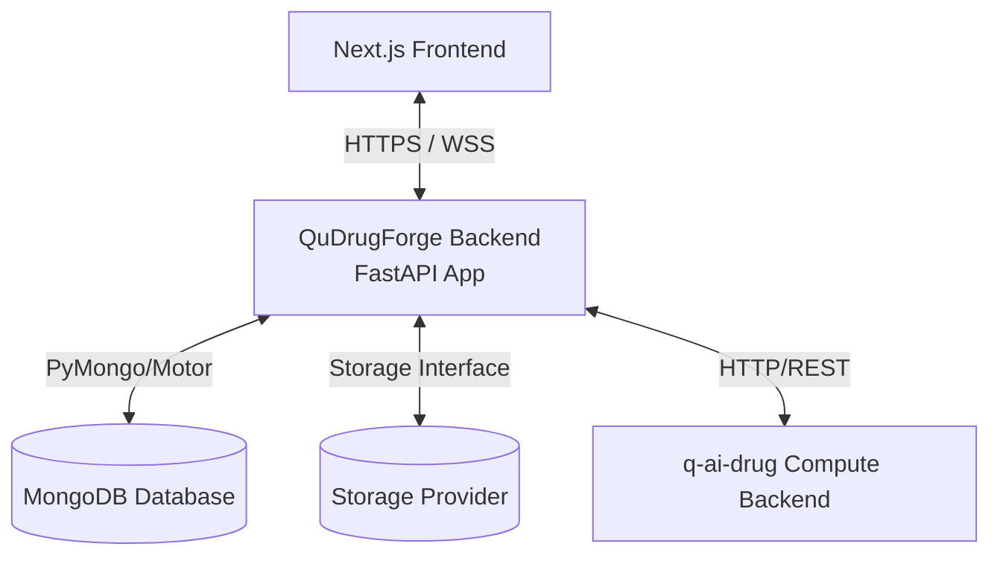

# QuDrugForge™ Backend
> **Quantum AI Drug Discovery Platform - Core Application Server**

QuDrugForge™ is a state-of-the-art Quantum AI Drug Discovery Platform. This repository contains the application backend built with **Python** and **FastAPI**, designed to coordinate research workspaces, manage chemical datasets, interface with advanced quantum compute engines, and serve high-fidelity scientific data visualization clients.

---

## 1. Core Purpose & Capabilities

The QuDrugForge™ application backend bridges the Next.js frontend prototype to physical databases, secure binary file stores, and external high-performance GPU simulation clusters. It acts as the central coordinator for:
* **Governance**: Secure workspace collaboration, compliance logs, and credential routing.
* **Chemical Data Ingestion**: Storage registry tracking physical proteins (PDB) and candidate molecular ligands (SDF/CSV).
* **Research Workspace Orchestration**: Launching AutoDock Vina, deep learning (GNINA) CNN poses, density functional theory (DFT) descriptor predictions, and ADMET toxicity profiling.
* **Science Translators**: Standardizing massive scientific outputs into rich, interactive visualization payloads (used in 3D chemical workspaces and dimensional chemical spaces).

---

## 2. Architectural Summary

QuDrugForge relies on a strictly structured decoupled architecture:



* **Application Backend** (This Repository): Houses user states, workspace parameters, metrics histories, file metadata catalogs, and acts as the gatekeeper.
* **Compute Engine** (`q-ai-drug` - External): An autonomous scientific compute cluster running intensive simulation tasks. **The frontend never communicates directly with the compute engine.**
* **Structured Data** (MongoDB): Holds JSON-native schemas representing molecular properties, workspace metrics, and configuration profiles. **MongoDB is never loaded with large raw files.**
* **Abstracted File Store**: Multi-cloud driver abstraction managing file binaries (`uploads`, `artifacts`, `reports`, `temp`) across local directories or enterprise cloud buckets (S3, Cloudflare R2, MinIO, Azure Blob).

---

## 3. Directory Layout

The codebase implements a clean, modular DDD (Domain-Driven Design) and Repository-Service pattern hierarchy:

```text
qudrugforge-backend/
├── app/
│   ├── main.py                     # Main application entrypoint & routing setup
│   ├── core/                       # App lifecycle settings, databases, and logs
│   │   ├── config.py               # Pydantic environment configurations
│   │   ├── database.py             # MongoDB Motor clients hooks
│   │   ├── security.py             # Password hashing and JWT generation
│   │   ├── logging.py              # Centralized logging formatters
│   │   └── exceptions.py           # Structured error handling handlers
│   ├── api/                        # HTTP Endpoint controllers
│   │   └── v1/
│   │       └── router.py           # Master V1 API Router
│   ├── schemas/                    # Pydantic v2 Request/Response models
│   ├── models/                     # MongoDB document models
│   ├── repositories/               # Raw Database CRUD operation abstraction
│   ├── services/                   # Business rules logic orchestrations
│   ├── storage/                    # Binary storage adapters (local, S3, etc.)
│   │   ├── base.py                 # Abstract storage driver contract
│   │   ├── local.py                # Secure local filesystem provider
│   │   └── service.py              # Central storage resolver
│   ├── integrations/               # Communication wrappers for external services
│   │   └── q_ai_drug_client.py     # q-ai-drug compute client adapter
│   └── utils/                      # Ephemeral structural helpers
├── storage/                        # Physical developer storage root
│   ├── uploads/                    # Original user uploads (proteins, libraries)
│   ├── artifacts/                  # Docking poses, QML scores
│   ├── reports/                    # Compiled analytical PDF/HTML studies
│   └── temp/                       # Temporary task packages
├── tests/                          # PyTest automated validation scripts
├── scripts/                        # Dev orchestration utility tools
├── docs/                           # Strategic architecture and mappings papers
├── .env.example                    # Environment variable configurations
├── .gitignore                      # Python and scientific paths filters
├── requirements.txt                # System packages registry
└── README.md                       # Repository guide
```

---

## 4. Development Setup

> [!NOTE]
> **This is a Phase 0 Foundation release.**
> The database and compute clients are pre-configured placeholders. You can run the application immediately locally without having active MongoDB or `q-ai-drug` clusters running online.

### Step 1: Environment Configuration
Copy the template variables file into a running `.env` file:
```bash
cp .env.example .env
```

### Step 2: Establish Virtual Environment & Install Packages
```bash
# Create environment
python -m venv .venv

# Activate on Windows
.venv\Scripts\activate

# Install dependencies
pip install -r requirements.txt
```

### Step 3: Launch Local Web Server
Start the local FastAPI development server:
```bash
uvicorn app.main:app --reload --port 8000
```

* **Interactive API Schema**: Open [http://127.0.0.1:8000/docs](http://127.0.0.1:8000/docs) in your browser to browse, test, and run available endpoints.
* **System Status Health Check**: Pinging [http://127.0.0.1:8000/health](http://127.0.0.1:8000/health) will confirm storage statuses.

---

## 5. Development Roadmap Summary

* [x] **Phase 0: Foundation Setup**: Provision clean repository frameworks, configuration schemas, storage models, and mapping specifications.
* [x] **Phase 1–9.5**: Auth, workspaces, projects, files, targets, molecules, q-ai-drug read-only, artifact importer, experiments/job tracking.
* [x] **Phase 10: Docking Backend APIs** _(current)_: Docking run orchestration, MongoDB result APIs, imported q-ai-drug docking support.
* [ ] **Phase 11**: GNINA, quantum, simulation, ADMET result APIs.
* [ ] **Phase 17**: Frontend integration — connect docking UI to real backend APIs.
* [ ] **Phase 20**: Full q-ai-drug execution orchestration (direct docking compute via q-ai-drug HTTP).

---

## 6. Phase 10 — Docking APIs

> **Phase 10** adds real docking backend routes so the frontend docking UI can stop depending on mock/static data.

### Endpoints Added

| Method | Path | Description |
|--------|------|-------------|
| `POST` | `/api/v1/projects/{project_id}/docking/runs` | Create a docking run (queued, non-blocking) |
| `GET` | `/api/v1/projects/{project_id}/docking/runs` | List all docking runs (type=docking experiments) |
| `GET` | `/api/v1/projects/{project_id}/docking/runs/{experiment_id}` | Get single docking run detail |
| `GET` | `/api/v1/projects/{project_id}/docking/results` | List docking results from `docking_results` collection |
| `GET` | `/api/v1/projects/{project_id}/docking/poses/{pose_id}` | Resolve pose file → metadata + download URL |

### Example: Create Docking Run

**Request:**
```json
POST /api/v1/projects/{project_id}/docking/runs
{
  "target_id": "682a1b2c3d4e5f6789abcdef",
  "compound_selection": {
    "mode": "all",
    "molecule_ids": []
  },
  "engine": "vina",
  "binding_site": {
    "mode": "box",
    "box": {
      "center_x": 10.4,
      "center_y": -4.2,
      "center_z": 18.9,
      "size_x": 20.0,
      "size_y": 20.0,
      "size_z": 20.0
    }
  },
  "parameters": {
    "exhaustiveness": 8,
    "num_modes": 9,
    "energy_range": 3
  }
}
```

**Response:**
```json
{
  "success": true,
  "data": {
    "experiment_id": "682a1c2d3e4f5a6789abcdef",
    "status": "queued",
    "name": "Docking Run — EGFR (VINA)",
    "engine": "vina",
    "target_id": "682a1b2c3d4e5f6789abcdef",
    "molecule_count": 300,
    "binding_site_mode": "box"
  },
  "message": "Docking run queued"
}
```

### Example: List Docking Results

**Response:**
```json
{
  "success": true,
  "data": {
    "items": [
      {
        "id": "...",
        "experiment_id": "...",
        "project_id": "...",
        "compound_id": "QDF-000001",
        "smiles": "CCO...",
        "engine": "vina",
        "binding_affinity_kcal_mol": -9.4,
        "pose_rank": 1,
        "pose_file_id": "file-uuid",
        "pose_download_url": "/api/v1/files/file-uuid/download",
        "status": "imported",
        "source": "q_ai_drug",
        "created_at": "2026-05-18T00:00:00Z"
      }
    ],
    "total": 1,
    "limit": 50,
    "offset": 0
  },
  "message": "Docking results fetched"
}
```

### Design Notes

- **Non-blocking**: `POST /docking/runs` creates an experiment record with `status: queued` and returns immediately. Heavy compute does NOT run inside the HTTP request.
- **Dev simulation** (optional): Pass `"simulate": true` to trigger background status progression `queued → running → completed` without scientific output. Clearly marked as dev-only.
- **Binding site fallback**: If no `binding_site` is provided in the request body, the API falls back to `project_inputs.binding_site`. If neither exists, `INPUT_NOT_READY` is returned.
- **q-ai-drug artifact import**: Docking results imported via the artifact importer (`/q-ai-drug/import-artifacts`) are stored in `docking_results` and immediately visible through `/docking/results`.
- **Pose file resolution**: `GET /docking/poses/{pose_id}` resolves a `file_id` UUID to registered file metadata and returns a `pose_download_url` consistent with `GET /api/v1/files/{file_id}/download`.
- **Direct q-ai-drug execution**: Full execution orchestration (calling q-ai-drug to run AutoDock Vina) is **Phase 20** work and is not implemented here.

### Collections Used

| Collection | Purpose |
|---|---|
| `experiments` | Docking run records (type=`docking`) |
| `docking_results` | Per-molecule binding results rows |
| `files` | Pose file metadata (SDF/PDB artifacts) |

### Files Created/Changed

| File | Status |
|---|---|
| `app/api/v1/docking.py` | Created — 5 route handlers |
| `app/schemas/docking.py` | Created — request/response Pydantic models |
| `app/services/docking_service.py` | Created — orchestration + validation logic |
| `app/repositories/docking_result_repository.py` | Updated — extended query params |
| `app/api/v1/router.py` | Updated — registered docking router |
| `tests/test_docking.py` | Created — 18 test cases |
| `docs/frontend_backend_mapping.md` | Updated — docking page mapping |

